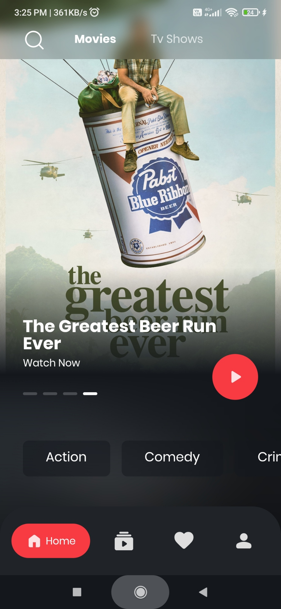
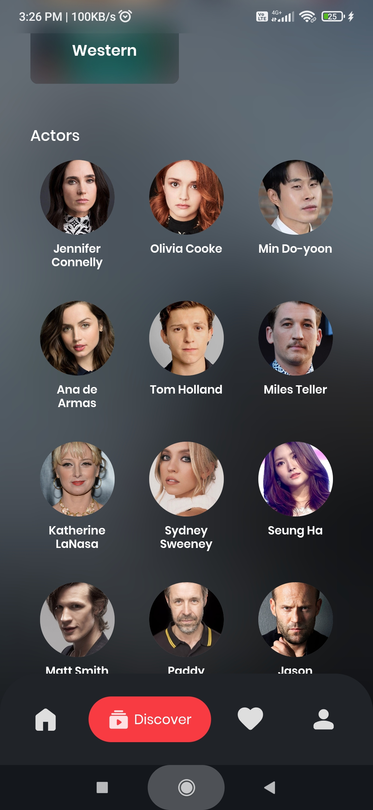
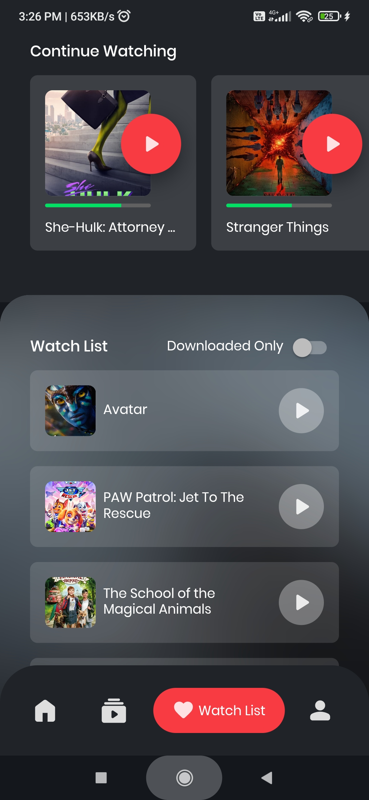
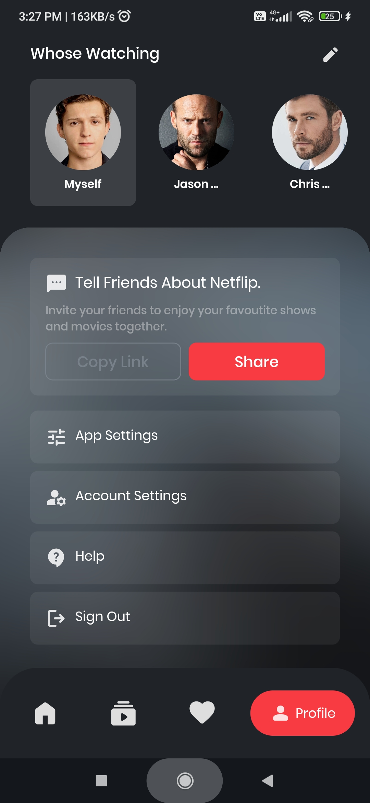

  

  

  # Netflip
  
  

  An interesting project for movie lovers. 
     
    <a href="#getting_started">Getting Started</a>
    ·
    <a href="#about_project">About The Project</a>
    ·
    <a href="#screenshots">Screenshots</a>
<!--     ·
    <a href="#design_pattern">Design Pattern</a> -->
    .
    <a href="#acknowledgments">Acknowledgments</a>
    ·
    <a href="#license">License</a>
  

 

 
<!-- GETTING STARTED -->

## :rocket: Getting Started

This project is a starting point for a Flutter application.

### Prerequisites

A few programmes should be installed if you have not started with Flutter:

- [Flutter](https://docs.flutter.dev/get-started/install)
- [Android Studio](https://developer.android.com/studio)
- [Xcode (mac)](https://developer.apple.com/xcode/resources/)
- [Visual Studio Code (optional)](https://code.visualstudio.com/Download)

For help getting started with Flutter development, view the
[online documentation](https://docs.flutter.dev/), which offers tutorials,
samples, guidance on mobile development, and a full API reference.

<a href="#top"> :arrow_up_small: </a>

 
<!-- ABOUT THE PROJECT -->

## :blue_book: About The Project

An interesting project for movie lovers. Users can search for movies here and browse them by artists and categories. Additionally, visitors may read reviews and see teasers and trailers for movies.
This project primarily focuses on integrating API data. In this case, the backend uses the TMDB movie data API.

 

### Built With

- [Dart](https://dart.dev/guides)
- [Flutter](https://docs.flutter.dev/get-started/codelab)

#### Packages and Integrations

- [Flutter Bloc](https://pub.dev/packages/flutter_bloc)
- [Freezed](https://pub.dev/packages/freezed) 
- [JSON Serializable](https://pub.dev/packages/json_serializable) 
- [Youtube Player Iframe](https://pub.dev/packages/youtube_player_iframe)
- [Get It](https://pub.dev/packages/get_it) 
- [Injectable](https://pub.dev/packages/injectable) 

<a href="#top"> :arrow_up_small: </a>

 
<!-- SCREENSHOTS -->

## :camera: Screenshots

    
    
    
    
    

<a href="#top"> :arrow_up_small: </a>

<!--   -->
<!-- DESIGN PATTERN -->
<!-- 

## :open_file_folder: Design Pattern

- components (global componets)
- config (app config like colors and size)
- data (dummy data)
- models
- controller (global state management)
- screens
  - home
    - view
    - widgets
    - controller (small controller of the view)
- utilities
  - services

<a href="#top"> :arrow_up_small: </a>
  -->

 
<!-- ACKNOWLEDGMENTS -->

## :smiling_face_with_three_hearts: Aknowledgments

- [rendy vickriansyah](https://www.figma.com/@rendy)
- [Stack Overflow](https://stackoverflow.com/)
- [Github Stickers](https://github.com/ikatyang/emoji-cheat-sheet/blob/master/README.md)
- [Youtube](https://youtube.com)

 
<!-- LICENSE -->

## :page_with_curl: License

un-licensed

<a href="#top"> :arrow_up_small: </a>

